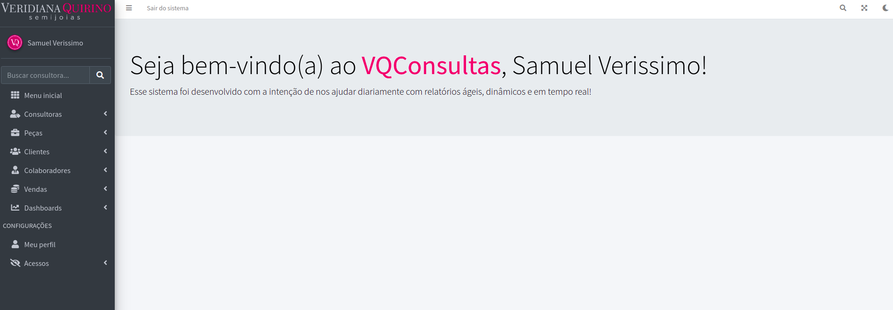

# Sistema Veridiana Quirino
Esse sistema foi desenvolvido exclusivamente e personalizadamente para a empresa "Veridiana Quirino", uma empresa que vende semi-joias para todo o Brasil! 

É um sistema que possuí diversos relatórios e alguns controles da empresa, como o gerenciamento de estoque e metas! o mesmo é utilizado em todos os escritórios e lojas da empresa.

# Menu inicial

### Principais funcionalidades

- Diversos relatórios totalmente customizados e interativos 
- Gerenciamentos (CRUD) conforme necessidades 
- Gerenciamento de usuários (+ permissões de páginas e visualização de dados específicos)
- Integração com o e-mail
- Integração com API's do Google (Google maps)

### Linguagens utilizadas 

- Bootstrap (Framework) 
- JavaScript (jQuery, AJAX)
- PHP (CodeIgniter4)
- SQLServer & MySQL (Banco de dados) 
